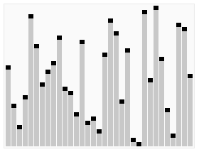

# Algoritmi di ordinamento

Una delle caratteristiche irrinunciabili in un calcolatore è la capacità di
_ordinare_ dati. È così irrinunciabile che il nome che i francesi danno al
computer moderno è _ordinateur_, ordinatore. Gli informatici nel corso degli anni
hanno studiato e messo a punto molti algoritmi di ordinamento, ovvero algoritmi
in grado di ordinare insiemi di dati (nel nostro caso array). Ciò che
differenzia un algoritmo dall'altro è il suo grado di ottimizzazione, ovvero il
numero medio di passi compiuti per giungere allo scopo finale (ovvero avere un
vettore ordinato in senso crescente o decrescente), e spesso e volentieri un
algoritmo abbastanza immediato per il nostro modo di ragionare non lo è per il
calcolatore, e viceversa. Ecco che la necessità di risparmiare in fatto di tempo
di esecuzione del codice sul calcolatore (necessità che diventa irrinunciabile
quando si deve ordinare una grande mole di dati) ha portato col tempo allo
sviluppo di algoritmi di ordinamento via via più complessi per la logica umana,
ma estremamente ottimizzati per il calcolatore. In questa sede prenderemo in
esame gli algoritmi più usati, andando in ordine crescente in quanto a
complessità (e decrescente in quanto a ottimizzazione): 

## Naive sort

Si tratta dell'algoritmo di ordinamento più semplice e anche meno ottimizzato
per il calcolatore. Quello che fa è trovare in un vettore la posizione
dell'elemento più grande. Se la sua posizione non è alla fine del vettore
(infatti in un vettore ordinato in modo crescente l'elemento più grande si trova
alla fine) allora scambia tra di loro l'elemento all'ultima posizione e il
valore massimo, in modo che l'elemento più grande si trovi all'ultima posizione.
All'iterazione successiva viene considerato il vettore come di dimensione dim-1,
dove dim è la dimensione di partenza. Vengono effettuate tali iterazioni finché
la dimensione del vettore non è uguale a 1 (ovvero il vettore è ordinato).
Esempio pratico dell'algoritmo:

v = {1,0,5,4}

v = {1,0,4,**5**}

v = {**0,1,4,5**}

Ed ecco come scriverlo in C (esempio applicato a un vettore di interi):

```c
// Procedura per lo scambio dei valori tra due variabili
void swap (int *a, int *b)  {
    int *tmp;
     
    tmp=a;
    a=b;
    b=tmp;
}
 
int findPosMax(int *v, int n)  {
    int i,p=0; /* ipotesi: max = v[0] */
     
    // Ciclo su tutti gli elementi dell'array
    for (i=1; i<n; i++)
        // Se l'elemento attuale è maggiore dell'elemento massimo,
        // allora il nuovo indice del massimo è quello appena trovato
        if (v[p]<v[i]) p=i;
    return p;
}
 
void naiveSort(int *v, int dim)  {
    int p;
     
    // Finché nel vettore ci sono elementi...
    while (dim>1) {
        // ...trova la posizione dell'elemento più grande
        p = findPosMax(v, dim);
             
        // Se la sua posizione non è alla fine del vettore,
        // scambia tra di loro l'elemento massimo e l'ultimo elemento
        if (p < dim-1) scambia(&v[p],&v[dim-1]);
        // Decrementa la dimensione del vettore
        dim--;
    }
}
```

## Bubble sort

Il bubble sort è un algoritmo più efficiente del naive anche se leggermente meno
intuitivo. Il difetto principale del naive sort è infatti quello che non si
accorge quando il vettore è già ordinato, e in tal caso continua a effettuare
iterazioni su di esso. Il bubble sort corregge questo difetto considerando
coppie adiacenti di elementi nel vettore, e non il vettore nella sua interezza,
e partendo dal presupposto che il vettore sia ordinato. Se due coppie adiacenti
qualsiasi sono scambiate tra di loro (prima il valore più grande e poi quello
più piccolo) effettua uno scambio, e quindi vuol dire che il vettore non era
ordinato. Se invece non si verifica alcuno scambio il vettore è già ordinato, e
quindi l'algoritmo termina.

Esempio applicativo:


Ecco un codice dell'algoritmo:

```c
// Prende come argomenti il vettore da ordinare e la sua dimensione
void bubbleSort(int *v, int dim){
    int i;
    bool ordinato = false;
         
    // Finché ci sono elementi nel vettore e il vettore non è ordinato...
    while (dim>1 && !ordinato) {
        // Ipotesi: vettore ordinato
        ordinato = true;
                         
        // Per tutti gli elementi nel vettore
        for (i=0; i<dim-1; i++)
            // Se l'i-esimo elemento è maggiore dell'i+1-esimo elemento...
            if (v[i]>v[i+1]) {
                // ...scambia tra di loro i due elementi
                swap(&v[i],&v[i+1]);
                 
                // Il vettore NON è ordinato
                ordinato = false;
            }

        // Considera il vettore come di dimensione dim-1
        dim--;
    }
}
```

## Insert sort

L'insert sort è un algoritmo che parte da un approccio diverso da quelli visti
finora: per ottenere un vettore ordinato basta _costruirlo_ ordinato, inserendo
ogni elemento al posto giusto. Ecco un esempio grafico:


Per implementarlo useremo due funzioni. La funzione _insertSort_ prende come
parametri il vettore da ordinare e la sua dimensione, e, per i che va da 0 a
N-1, inserisce alla posizione corretta all'interno del sottovettore
_v[0],...,v[i]_ l'i-esimo elemento del vettore:

```c
void insertSort(int *v, int dim)  {
    int i;
     
    // Ciclo su tutti gli elementi
    for (i=1; i<dim; i++)
        // Inserisco al posto giusto l'i-esimo elemento
        insMinore(v,i);
}
```

La funzione _insMinore_ prende come parametri il vettore e la posizione
dell'elemento da ordinare. Questa funzione determina la posizione in cui va
inserito l'elemento alla posizione specificata, crea lo spazio per l'inserimento
spostando gli elementi all'interno del vettore ed effettua l'inserimento:

```c
void insMinore(int *v, int lastpos)  {
    int i, x = v[lastpos];
     
    for (i = lastpos-1; i>=0 && x<v[i]; i--)
            v[i+1]= v[i]; /* crea lo spazio */
    v[i+1]=x;
}
```

## Quick sort

Avvicinandoci via via ad algoritmi sempre più ottimizzati giungiamo al _quick
sort_, algoritmo di default per l'ordinamento usato ancora oggi dal C. Il quick
sort si basa su un principio relativamente semplice: ordinare un vettore di
piccole dimensioni è molto meno costoso dell'ordinare un vettore di grandi
dimensioni. L'idea è quella di dividere il vettore di principio in due
sottovettori, con un elemento intermedio (chiamato _pivot_). Le celle di memoria
prima del pivot conterranno tutti gli elementi minori del pivot, quelle
successive gli elementi maggiori del pivot. A questo punto l'algoritmo viene
applicato ricorsivamente ai due sottovettori, fino ad arrivare a vettori di
dimensione unitaria che, per definizione, sono già ordinati. Ecco una piccola
animazione che illustra il funzionamento:



Ed ecco una possibile specifica:

```c
void qSort(int v[], int first, int last){
      if (vettore non vuoto)
          <scegli come pivot l’elemento medio>
          <isola nella prima metà vettore gli
          elementi minori o uguali al pivot e
          nella seconda metà quelli maggiori>
          <richiama quicksort ricorsivamente
          sui due sottovettori >
}
```

Codice:

```c
void qSort(int *v, int first, int last){
    int i,j,pivot;
     
    if (first<last) {
        // Partenza: i parte dal primo elemento del vettore, j dall'ultimo
        i = first; j = last;
             
        // Il pivot è l'elemento medio del vettore
        pivot = v[(first + last)/2];

        do {
            // Finché l'elemento generico i-esimo a sinistra del pivot
            // è minore del pivot, incrementa i
            while (v[i] < pivot) i++;
                               
            // Finché l'elemento generico j-esimo a destra del pivot
            // è maggiore del pivot, decrementa j
            while (v[j] > pivot) j--;
                                                 
            // Altrimenti, scambia tra loro l'elemento i-esimo e quello j-esimo
            if (i <= j) {
                swap(&v[i], &v[j]);
                i++, j--;
            }
        } while (i <= j);  // Cicla finché i e j non si incontrano

        // Richiama il quick sort sul primo sottovettore
        qSort(v, first, j);
                 
        // Richiama il quick sort sul secondo sottovettore
        quickSort(v, i, last);
    }
}
```
