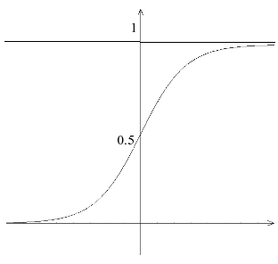

# Introduzione alle reti neurali

## Sistemi fuzzy

I sistemi fuzzy sono sistemi che si ispirano alla logica fuzzy, una logica
polivalente che si può considerare un ampliamento della logica booleana
classica, che prende in esame non solo un numero discreto possibile di valori,
come lo 0 e 1 nell'algebra di Boole, ma anche possibili valori “intermedi” non
numerabili. La logica fuzzy si pone quindi come valida alternativa alla logica
tradizionale nell'esame dei problemi reali, in cui i valori che possono assumere
le variabili in gioco non sono numerabili, o almeno non facilmente numerabili.

## Introduzione alle reti neurali

Le reti neurali sono un'applicazione dell'intelligenza artificiale relativamente
vecchia (sono state teorizzate negli anni '60, per poi essere abbandonate sui
primi anni '70 in seguito alla pubblicazione, da parte di M.Minsky e S.Papert,
di Perceptrons, un libro che metteva in risalto le carenze della tecnologia), ma
che ultimamente sta vivendo un periodo di rinascita in seguito al rinnovato
interesse nei confronti delle tecniche di intelligenza artificiale e al
perfezionamento di questa tecnologia stessa.

Il meccanismo delle reti neurali si ispira dichiaratamente a quello del sistema
nervoso degli animali. Le reti neurali non sono progettate per “nascere
imparate”, né tantomeno per avere una grande precisione in fatto di calcolo
(d'altronde la potenza di calcolo di un cervello umano verrebbe facilmente
ridicolizzata da qualsiasi calcolatrice), ma sono progettate per apprendere. La
fase di apprendimento di una rete neurale si basa su un campione di dati
(“training set”) che viene presentato alla rete stessa, spesso con i risultati
che si desiderano ottenere. Ad esempio, se voglio addestrare una rete neurale a
risolvere le 4 operazioni fondamentali, posso presentare in input alla rete
diversi numeri, e poi i risultati che desidero ottenere con quei numeri. Sarà la
rete stessa a imparare, graduatamente, i meccanismi che sono alla base
dell'operazione che deve compiere. Ovviamente, più corposo sarà il training set
della rete, più precisi saranno i risultati che si potranno ottenere una volta
completato l'addestramento.

Le reti neurali, come accennavo prima, non sono molto usate nel campo del
calcolo matematico-scientifico, proprio in base alla loro scarsa precisione da
sistemi fuzzy, ma si rivelano utilissime (proprio in virtù delle loro
caratteristiche fuzzy) nella risoluzione di problemi reali. Un cervello umano
non saprà risolvere un integrale definito con il metodo dei rettangoli con la
stessa rapidità con cui lo risolverebbe un calcolatore elettronico, ma può
riconoscere con una facilità disarmante un cane da un albero, o la voce di un
amico da lontano, anche se disturbata da altri rumori. Delle applicazioni simili
in campo tecnologico le hanno anche le reti neurali, utili, ad esempio, per il
riconoscimento visivo elettronico, per il riconoscimento vocale, e così via.

## Struttura di una rete neurale

La struttura di una rete neurale si rifà esplicitamente a quella di una rete
neurale umana. Nell'uomo i neuroni sono costituiti da un corpo cellulare (soma)
e da dentriti che mettono il neurone in comunicazione con altri neuroni. In
presenza di determinati segnali queste comunicazioni si attivano (sinapsi), con
il rilascio di sostanze di tipo chimico-ormonale (neurotrasmettitori) che
trasmettono lo stimolo da un neurone all'altro. L'input di un neurone non è
altro che la media pesata di tutti i segnali provenienti in input dagli altri
neuroni per il “peso sinattico” della sinapsi in questione, ovvero
l'”importanza” che riveste quella sinapsi nel collegamento. In base a questo
valore, chiamato potenziale post-sinattico, il neurone può rispondere con una
valore di output, che può essere minore o maggiore in fatto di intensità
rispetto al precedente (effetto “calmante” o “eccitante”) in base ai valori
degli input in quel dato momento.

Un neurone artificiale ha una struttura simile:


Dove `MISSING_MATH` sono gli input presentati al neurone o alla rete neurale,
`MISSING_MATH` sono i pesi sinattici delle singole connessioni (ovvero quanto
quella connessione influenza il risultato finale). La media pesata degli input
per i pesi sinattici delle singole connessioni fornisce il potenziale
post-sinattico del neurone:

`MISSING_MATH`

L'output y del neurone è dato da f (P-0), dove 0 è una soglia caratteristica del
neurone, mentre f è una funzione di trasferimento. Le principali funzioni di
trasferimento utilizzate nelle reti neurali sono la funzione a gradino, la
funzione sigmoidale e la tangente iperbolica, tutte funzioni aventi codominio
nell'intervallo `[0,1]` (o [-1,1] nel caso della tangente iperbolica).

La funzione a gradino, il tipo di funzione di trasferimento più semplice usata
nelle reti neurali, è una funzione così definita:


Grafico della funzione:


ando questa funzione, il neurone emette un segnale y=1 quando x = (P-0) >= 0,
quindi P>=0, mentre emette un segnale y=0 (quindi rimane inattivo) quando P<0.

Un'altra caratteristica funzione di trasferimento è la sigmoidale, o curva
logistica, di equazione

`MISSING_MATH`

Al variare del parametro A la curva può diventare più o meno “ripida”. In
particolare, la curva tende alla funzione a gradino g(x) che abbiamo visto prima
per A->-inf, mentre invece tende g(-x) quando A->+inf.



Se x=0, ovvero se P=0, allora il valore di uscita del neurone artificiale sarà
0.5, mentre invece sarà approssimativamente 0 (ovvero il neurone è “spento”) per
`0>>P` e 1 per `0<<P`. Una proprietà molto interessante di questa funzione, una
proprietà molto utilizzata nella fase di apprendimento delle reti neurali,
riguarda sua sua derivata prima. In particolare

`MISSING_MATH`

Questa proprietà implica che la derivata della funzione sigmoidale si può
scrivere come un semplice prodotto, sorvolando le regole di derivazione, e
questo è molto utile a fine computazionale (un calcolatore potrà trovare
facilmente la derivata di una funzione così costruita).

Una funzione alternativa alla sigmoidale, relativamente meno usata nel campo
delle reti neurali, è la tangente iperbolica, di equazione

`MISSING_MATH`

Una funzione definita `MISSING_MATH` a differenza delle due che abbiamo visto
prima che sono a codominio in [0,1].

Ogni neurone può dare in un dato momento, come abbiamo visto, un solo valore in
output in funzione dei suoi input, mentre una rete neurale può complessivamente
dare un numero variabile di valori in output. Se quindi una rete ha input n
valori  in un dato momento, la rete darà in output m valori  in quel momento, in
funzione delle . Ovvero

Quindi i valori in input in un certo momento sono un vettore X di n componenti,
generalmente compresi tra 0 e 1. Anche gli m valori del vettore di output Y sono
compresi tra 0 e 1, in quanto vengono confinati in questo intervallo dalla
funzione di trasferimento usata (funzione a gradino o sigmoidale), quindi il
vettore X va a identificare un punto A all'interno di un ipercubo booleano di n
dimensioni, e Y un punto B all'interno di un'altro ipercubo booleano a m
dimensioni. Nel caso di n=m=2 gli ipercubi degenerano in 2 quadrati di  vertici,
mentre invece nel caso n=m=3 gli ipercubi degenerano in 2 cubi di  vertici. La
rete neurale può quindi essere vista come un'applicazione binaria che associa a
ogni punto A contenuto nel primo ipercubo un punto B contenuto nel secondo. La
grande idea alla base delle reti neurali però non è solo l'applicazione binaria
tra i punti di un insieme e i punti di un altro insieme. L'applicazione associa
il punto A e anche un suo intorno ad un intorno del punto B del secondo insieme.
Questo è molto utile nel caso in cui i segnali di input sono “sporcati”, ad
esempio nel caso di una rete neurale per il riconoscimento vocale, in grado di
fare il suo dovere anche quando il suono è sporcato da rumori esterni, oppure
una rete neurale per il riconoscimento calligrafico, in grado di fare il suo
dovere anche quando il simbolo grafico non è perfettamente identico a quello
appreso in fase di training. Questa proprietà deriva proprio dalle proprietà
tipicamente fuzzy delle reti neurali.

## Tecniche di apprendimento

Le reti neurali possono apprendere in due modi diversi: in modo supervisionato e
in modo non supervisionato.  Nel primo caso, in ogni istante t vengono
presentati alla rete dei campioni  in input, e i corrispondenti valori di output
desiderati. Le variazioni dei pesi sinattici

sono una funzione dell'errore, e quindi dello scarto , dove  è l'output
ottenuto, e  l'output desiderato. Gli algoritmi di apprendimento in genere hanno
come obiettivo quello di minimizzare l'errore quadratico medio. Quindi
un'apprendimento supervisionato richiede la conoscenza sia dei valori di input ,
sia dei valori desiderati . Questi due tipi di dato forninscono quello che viene
definito il training set della rete neurale.  Nel caso dell'apprendimento non
supervisionato, vengono forniti alla rete molti campioni di input , da associare
a un numero m di classi . Il programmatore non fornisce alla rete la classe di
appartenenza di ogni vettore di input; è la rete stessa ad auto-organizzarsi,
modificando i suoi pesi sinattici in modo da poter eseguire classificazioni
corrette. Gli algoritmi di apprendimento hebbiani sono classificabili
all'interno di questa categoria. Questi algoritmi, basati sulla legge di Hebb,
rafforzano il peso sinattico  tra due generici neuroni i, j quando la loro
attività è concorde (ovvero quando i risultati delle loro funzioni di
trasferimento  sono di segno concorde), mentre lo indebolisce nel caso opposto,
esattamente come accade tra i neuroni del sistema nervoso umano:

Dove n è un coefficiente compreso tra 0 e 1 da cui dipende la variazione del
peso sinattico. Le reti neurali possono apprendere in due modi diversi: in modo
supervisionato e in modo non supervisionato.  Nel primo caso, in ogni istante t
vengono presentati alla rete dei campioni  in input, e i corrispondenti valori
di output  desiderati. Le variazioni dei pesi sinattici

sono una funzione dell'errore, e quindi dello scarto , dove  è l'output
ottenuto, e  l'output desiderato. Gli algoritmi di apprendimento in genere hanno
come obiettivo quello di minimizzare l'errore quadratico medio. Quindi
un'apprendimento supervisionato richiede la conoscenza sia dei valori di input ,
sia dei valori desiderati . Questi due tipi di dato forninscono quello che viene
definito il training set della rete neurale.  Nel caso dell'apprendimento non
supervisionato, vengono forniti alla rete molti campioni di input , da associare
a un numero m di classi . Il programmatore non fornisce alla rete la classe di
appartenenza di ogni vettore di input; è la rete stessa ad auto-organizzarsi,
modificando i suoi pesi sinattici in modo da poter eseguire classificazioni
corrette. Gli algoritmi di apprendimento hebbiani sono classificabili
all'interno di questa categoria. Questi algoritmi, basati sulla legge di Hebb,
rafforzano il peso sinattico  tra due generici neuroni i, j quando la loro
attività è concorde (ovvero quando i risultati delle loro funzioni di
trasferimento  sono di segno concorde), mentre lo indebolisce nel caso opposto,
esattamente come accade tra i neuroni del sistema nervoso umano:

Dove n è un coefficiente compreso tra 0 e 1 da cui dipende la variazione del
peso sinattico.

## Sviluppo di una rete neurale

Sviluppare una rete neurale da zero può essere una procedura molto impegnativa,
e facilmente soggetta a errori. È per questo che spesso si usano librerie
esterne.  Io stesso ho sviluppato Neural++ come libreria in C++ per la gestione
di reti neurali, e NeuralPerl che è il suo relativo porting in Perl. In C e non
solo in ogni caso uno standard de facto è diventata la libreria fann (Fast
Artificial Neural Network), reperibile all'indirizzo http://leenissen.dk/fann/ e
di cui esistono porting nella maggior parte dei linguaggi più diffusi (C, C++,
Perl, PHP, Java, Matlab, .NET, Ruby, Python, Delphi...). Per implementare una
semplice rete neurale che impara da sola a fare le somme fra due numeri reali
utilizzeremo proprio questa libreria.  Dopo aver visto come implementare codice
che usi librerie esterne come gc e readline dò per scontato che si sappia come
installare correttamente la libreria.

La prima cosa da fare per poter programmare una rete neurale che impari a
effettuare delle somme è capire quanti neuroni vogliamo in input e quanti in
output, e creare un file del genere per l'addestramento, che chiameremo
add.data, contenente il training set della rete:

```
4 2 1
2 3
5
3 4
7
-1 -2
-3
5 5
10
```

La prima riga di questo file serve a dire “questo file contiene 4 training set,
per una rete neurale avente 2 neuroni di input (vogliamo che apprenda a sommare
due numeri reali, quindi avrà come input i due numeri da sommare) e un neurone
di output (il risultato più vicino alla somma dei due numeri)”.

Di seguito abbiamo 4 training set. Il primo insegna che “2+3=5”, il secondo che
“3+4=7”, il terzo che “-1 + (-2) = -3”, e il quarto che “5+5=10”. Scriviamo ora
il codice che partendo da questo training set crei la rete neurale, e proviamo a
dargli in pasto due numeri qualsiasi per vedere se riesce a sommarli. Il codice
sarà il seguente:

```
#include        <stdio.h>
#include        <stdlib.h>
#include        <fann.h>

int main ( int argc, char **argv )  {
    const unsigned int num_layers = 3;
    const unsigned int num_input  = 2;
    const unsigned int num_hidden = 3;
    const unsigned int num_output = 1;
    const unsigned int max_epochs = 500000;
    const unsigned int epochs_between = 1000;
    const float desired_error = (const float) 0.0001;

    struct fann *ann;
    fann_type input[2];
    fann_type *output;

    ann = fann_create_standard (num_layers, num_input, num_hidden, num_output);
    fann_set_activation_function_hidden(ann, FANN_LINEAR);
    fann_set_activation_function_output(ann, FANN_LINEAR);
    fann_train_on_file(ann, "add.data", max_epochs, epochs_between,
                       desired_error);
    fann_save(ann, "add.nn");

    input[0] = 4;
    input[1] = 5;
    output = fann_run(ann, input);
    printf ("(%f, %f) -> %f ", input[0], input[1], output[0]);

    fann_destroy(ann);
    return EXIT_SUCCESS;
}
```

La nostra rete avrà 3 layer, uno di input, uno nascosto e uno di output,
contenenti rispettivamente 2, 3 e 1 neuroni. Il massimo numero di cicli di
addestramento che vogliamo che la rete compia è 500 000, vogliamo che ci sia un
controllo sui risultati ogni 1000 cicli, e che l'errore massimo in output sia
nell'ordine di 0.0001 (la fase di addestramento terminerà o quando l'errore sarà
al di sotto di questa soglia, o quando avrò compiuto almeno 500 000 cicli di
addestramento). Attraverso la funzione `fann_create_standard` creo una rete
neurale con i requisiti specificati  salvandola nell'oggetto di tipo struct
`fann*` chiamato ann. Attraverso `fann_set_activation_function_hidden`  e
`fann_set_activation_function_output` specifico quale funzione di trasferimento
usare rispettivamente per i neuroni nel layer nascosto e in quello di output
(per entrambi uso una funzione di trasferimento lineare, semplicemente f(x) = x,
ma potrei anche voler usare una funzione di soglia lineare, una sigmoide, una
gaussiana o una sinusoide, l'elenco completo delle funzioni supportate dalla
libreria è presente qui:
`http://leenissen.dk/fann/html/files/fann_data-h.html#fann_activationfunc_enum`).
A questo punto richiamo la funzione `fann_train_on_file` specificando il file da
prendere come training set (quello che abbiamo creato prima) e i parametri per
l'apprendimento, e salvo la rete neurale così creata su un file chiamato add.nn,
in modo che per le prossime esecuzioni, se la rete neurale mi soddisfa, posso
direttamente caricarla da quel file attraverso la funzione
`fann_create_from_file`. Ora tutto ciò che mi resta da fare è dare in pasto alla
mia rete neurale un vettore contenente due valori numerici (in questo caso
testiamo con 4 e 5), e vedere cosa ci dà in output, attraverso la funzione
`fann_run`. Quindi stampiamo il risultato e deallochiamo la rete neurale
attraverso `fann_destroy`.

Per compilare il codice, dopo aver installato la libreria:

    gcc -o add add.c -lfann

A questo punto la testiamo:

    (4.000000, 5.000000) -> 9.004067

Come vediamo già con un training set di soli 4 elementi riusciamo ad avere una
rete neurale che apprende a fare le somme con un errore relativamente basso.
