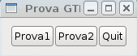

# Programmazione di interfacce grafiche in C - cenni di gtk

Molte applicazioni presenti oggigiorno sono basate su interfacce grafiche più o
meno sofisticate anziché su interfacce da terminale. L'interfaccia utente
dovrebbe essere l'ultimo passo nello sviluppo di un buon software modulare,
bisognerebbe prima accertarsi che la logica del programma funzioni a modo senza
errori e quindi progettare l'interfaccia, che può essere basata su riga di
comando pura, su librerie pseudo-grafiche come ncurses, o su un'interfaccia
grafica vera e propria, basata su un toolkit grafico o un altro. Finora durante
questo corso abbiamo imparato come gestire la logica di un programma attraverso
tutti i costrutti del C, senza curarci molto di come interfacciarsi con l'utente
al di là della riga di comando fine a se stessa. Ora vediamo come sviluppare
rudimentali interfacce grafiche usando il toolkit gtk+ 2.0, su cui è basato ad
esempio l'ambiente grafico Gnome e molte applicazioni importanti (fra cui
VMware, GIMP, OpenOffice, Eclipse, Anjuta, e così via). Non è mia intenzione
offrire una panoramica completa ed esaustiva su quest'insieme di librerie, anche
perché sul sito ufficiale è possibile trovare tutorial e documentazione più
lunghi di questa guida stessa. In questa guida al C credo sia più opportuno
entrare nella logica delle Gtk, capendo attraverso esempi semplici come funziona
il paradigma della creazione di nuovi oggetti grafici, il settaggio delle
proprietà su questi oggetti, e il meccanismo di connessioni a segnali per
stabilire che azioni compiere quando l'utente interagisce con questi elementi.

Innanzitutto occorre installare le librerie sul proprio sistema. Se si usa un
sistema Unix-based probabilmente le librerie saranno già installate di default,
ma per sviluppare applicazioni che le sfruttano potrebbe essere necessario
installare il pacchetto contenente i rispettivi header, nel caso di Debian,
Ubuntu e derivate si chiama libgtk2.0-dev.

Vediamo subito il primo esempio di un sorgente che fa uso delle Gtk per creare
una semplice interfaccia grafica:

```c
#include <string.h>
#include <gtk/gtk.h>

void quick_message ( GtkWidget *widget, gchar* message )  {
    GtkWidget *dialog, *label, *content;

    dialog = gtk_dialog_new_with_buttons (
            "Messaggio",
            (GtkWindow*) widget,
            GTK_DIALOG_DESTROY_WITH_PARENT,
            GTK_STOCK_OK,
            GTK_RESPONSE_NONE,
            NULL
            );

    content = gtk_dialog_get_content_area( GTK_DIALOG(dialog) );
    label = gtk_label_new( message );
    g_signal_connect_swapped(
            dialog,
            "response",
            G_CALLBACK(gtk_widget_destroy),
            dialog
            );

    gtk_container_add (GTK_CONTAINER(content),
            label);
    gtk_widget_show_all(dialog);
}

static void hello( GtkWidget *widget, gpointer data )  {
    g_print ("GTK test - %s was pressed\n",(gchar*) data);

    if (!strcmp((gchar*) data,"quit"))
        gtk_main_quit();
    else
        quick_message( widget, (gchar*) data );
}

static void destroy( GtkWidget *widget, gpointer data )  {
    gtk_main_quit ();
}

int main(int argc, char **argv)  {
    GtkWidget *window;
    GtkWidget *button;
    GtkWidget *box;

    gtk_init (&argc, &argv);

    window = gtk_window_new (GTK_WINDOW_TOPLEVEL);
    gtk_window_set_title (GTK_WINDOW(window),"Prova GTK");

    g_signal_connect (G_OBJECT(window),
            "destroy", G_CALLBACK(destroy), NULL);

    gtk_container_set_border_width (GTK_CONTAINER(window), 10);

    box = gtk_hbox_new(FALSE,0);
    gtk_container_add (GTK_CONTAINER(window),box);

    button = gtk_button_new_with_label ("Prova1");
    g_signal_connect (G_OBJECT(button), "clicked",
            G_CALLBACK(hello), (gpointer) "prova1");
    gtk_box_pack_start (GTK_BOX(box),button,FALSE,FALSE,1);
    gtk_widget_show (button);

    button = gtk_button_new_with_label ("Prova2");
    g_signal_connect (G_OBJECT(button), "clicked", G_CALLBACK(hello),
            (gpointer) "prova2");
    gtk_box_pack_start (GTK_BOX(box),button,FALSE,FALSE,1);
    gtk_widget_show (button);

    button = gtk_button_new_with_label ("Quit");
    g_signal_connect (G_OBJECT(button), "clicked", G_CALLBACK(hello),
            (gpointer) "quit");
    gtk_box_pack_start (GTK_BOX(box),button,FALSE,FALSE,1);
    gtk_widget_show (button);

    gtk_widget_show (box);
    gtk_widget_show (window);
    gtk_main ();

    return 0;
}
```

Per la compilazione la cosa migliore, se le Gtk sono correttamente installate
sul proprio sistema (e si sta usando un sistema Unix-based), è quella di usare
pkg-config per ottenere i flag da passare a gcc, dato che ci sono molti flag di
compilazione, specifica di file header, librerie e opzioni:

    gcc -o test_gtk test_gtk.c `pkg-config --cflags --libs gtk+-2.0`

Una volta avviato l'eseguibile ci troveremo davanti a un'interfaccia del genere:



Premendo Prova1 o Prova2 comparirà una nuova finestra di “alert” contenente
rispettivamente “prova1” o “prova2”, mentre premendo Quit l'applicazione
terminerà. Non è mia intenzione spiegare tutti i dettagli del programma o i
parametri che ogni funzione prende, anche perché la documentazione ufficiale
disponibile su `http://www.gtk.org/documentation.html` spiega ogni funzione e
macro nel dettaglio meglio di quanto lo possa fare un corso generico di C.
L'obiettivo è piuttosto quello di capire l'ottica di funzionamento della
libreria.

Innanzitutto l'intero ambiente è inizializzato da una chiamata a `gtk_init`, che
prende come argomenti i reference ad argc e argv passati al main. In secondo
luogo creiamo una nuova finestra attraverso la chiamata a `gtk_window_new`, e
con `gtk_window_set_title` settiamo il suo nome. Una delle funzioni principali
nella programmazione con le Gtk è `g_signal_connect`, che collega una certa
interazione con un elemento grafico in un'azione da compiere (le azioni sono
gestite semplicemente come puntatori a funzione che l'utente può stabilire a
proprio piacimento). Nel nostro caso dopo aver creato l'oggetto “finestra” gli
associamo l'azione da eseguire nel caso in cui la finestra venga chiusa, ad
esempio cliccando sulla X. Se l'evento è “destroy” richiamato sul widget
“window”, allora esegui la funzione “destroy” dichiarata nel codice, che
attraverso una chiamata a `gtk_main_quit` termina l'applicazione.

Ora richiamando la funzione `gtk_container_set_border_width` settiamo a 10 pixel
la distanza fra gli elementi della finestra e i suoi bordi, in modo da evitare
l'effetto “spiattellamento” degli elementi sui bordi. Quindi con `gtk_hbox_new`
creiamo un nuovo layout per la finestra, orizzontale, dato che vogliamo disporre
gli oggetti in orizzontale (per crearlo in verticale useremmo `gtk_vbox_new`, e
i layout si possono anche combinare a vicenda fra loro e inserire uno dentro
l'altro), e con `gtk_container_add` settiamo questo layout per l'oggetto window.
Ora creiamo i pulsanti prova1, prova2 e quit attraverso la chiamata a
`gtk_button_new_with_label`, associamo all'azione clicked eseguita sui pulsanti
la chiamata della funzione hello, aggiungiamo uno per uno i pulsanti al layout
box precedentemente creato, e mostriamo il tutto con `gtk_widget_show`. Quindi
alla fine del main richiamiamo `gtk_main`, che avvia il ciclo per la
visualizzazione e la gestione dell'interfaccia grafica.

Venendo ora alla funzione `hello`, notiamo che quando abbiamo connesso la
funzione all'evento `clicked` dei pulsanti abbiamo passato anche come parametro
il nome del pulsante, che può essere castato a `gchar*` o `char*` e quindi usato
per identificare il “chiamante”, ovvero quale pulsante ha scatenato l'evento.
Nel caso in cui il pulsante “quit” avesse parlato semplicemente terminiamo
l'applicazione, altrimenti richiamiamo il metodo `quick_message` passandogli
come parametro il widget Gtk principale e il nome del pulsante. Questa funzione
non fa altro che creare una finestrella di alert contenente il nome del pulsante
che ha “chiamato”.

Come primo esempio di applicazione con le Gtk questo è molto semplice ma ha
toccato diversi aspetti. L'obiettivo è quello di fornire un'infarinatura sui
meccanismi per la programmazione di GUI. Per qualsiasi approfondimento su altri
widget, funzioni o segnali basta andare sul sito ufficiale e consultare la
documentazione.

Buona programmazione a tutti.
